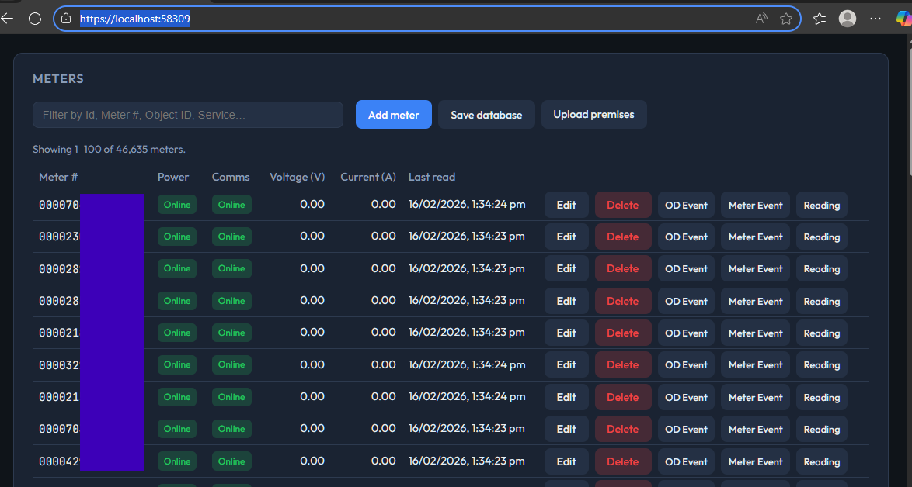
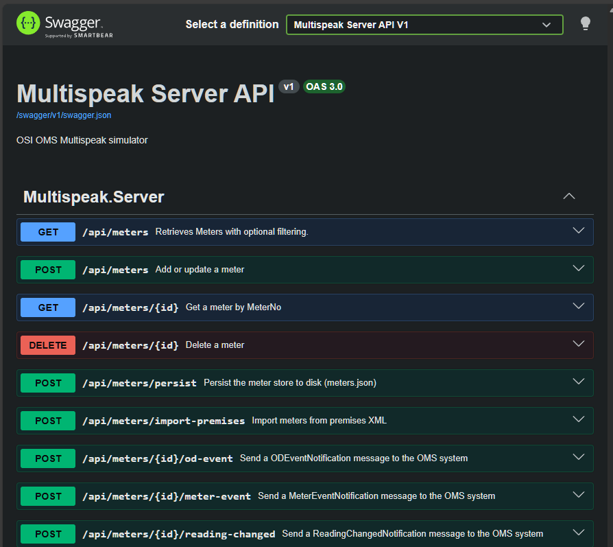
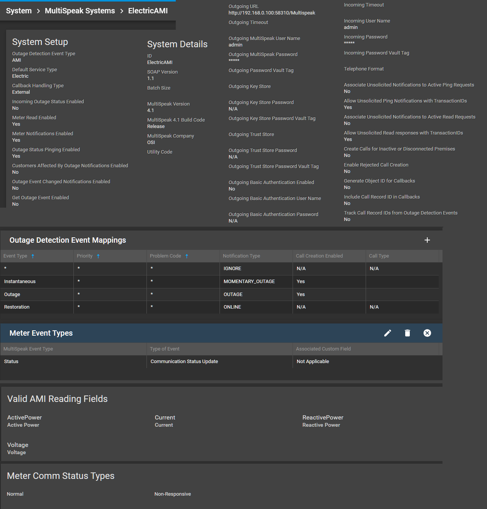

# OSI MultiSpeak Service

This project is an extensible MultiSpeak service that can interface with the OSI Monarch Electra Outage Management System.  The service can be used in one of two ways:
1. As a simulator for testing and development of OMS integrations, with a built in UI for managing meters and sending messages to OMS.
2. As a base for developing a production MultiSpeak service that can integrate with real metering systems, with support for plugins to allow for multiple metering providers.

Built on **.NET 10** with **CoreWCF** and **ASP.NET Core**.

Fair warning: This codebase is of prototype quality.

## Features

- The server implements part of the **OMS MultiSpeak v4.1** specification ( `OMS_MultiSpeak_v41.wsdl`), the following features are supported:
  - `PingURL`, `GetMethods`
  - `InitiateOutageDetectionEventRequest`, `ODEventNotification`
  - `InitiateMeterReadingsByMeterID`, `ReadingChangedNotification`
  - `MeterEventNotification`
- **In-memory meter store**: virtual meters that store Power status, Communication status, and a list of measurements.  Meter store can be populated from an OSI Premise.xml import file, via the REST API, or via Plugins.
- **Web UI**: manage meters and send unsolicited messages to OMS.
- Plugin interface that allows the service to be extended to support multiple metering providers.  A built in Simulator plugin is provided that will return data direct from the Meter Store.



## Getting Started

### Configuration

Example `appsettings.json`:

```json
{
  "Plugins": [
    "MultiSpeak.Sim.dll"
  ],

  "Logging": {
    "LogLevel": {
      "Default": "Information",
      "Microsoft.AspNetCore": "Warning"
    }
  },
  "MultiSpeakClient": {
    "BaseUrl": "http://192.168.0.1:8080",
    "MultiSpeakPath": "/axis2/services/OMS_MultiSpeak_v41.OMS_MultiSpeak_v41_Soap11_Endpoint/",
    "Username": "admin",
    "Password": "admin",
  }
  "Kestrel": {
    "Endpoints": {
      "Http": { "Url": "http://0.0.0.0:5001" }
    }
  }
}
```

### Run

```
cd MultiSpeak.Server
dotnet run
```

## Basic Usage

Default endpoints:
- **Simulation UI**: http://localhost:5001/
- **API**: http://localhost:5001/swagger
- **SOAP endpoint**: http://localhost:5001/MultiSpeak  (SOAP 1.1)
- **SOAP endpoint**: http://localhost:58310/MultiSpeak12 (SOAP 1.2)

HTTPS endpoints can also be configured by adding an HTTPS endpoint in the appsettings.json, and providing a TLS certificate.  For testing purposes, you can generate a self-signed certificate and configure Kestrel to use it.

The Meter Store can be populated manually by using the UI, from an OMS Premises XML file, or via the REST API. The Meter Store can be persisted by using the Save database function, or via the REST API.  The store is written to meters.json in the project folder.

Use the Simuation UI to edit meter data, and send unsolicited messages to OMS.

## REST API
There is a Rest API for interacting with the Meter Store and sending unsolicited commands to OMS.  Refer to Swagger for details.



## OSI OMS Setup
A minimum viable OMS MultiSpeak configuration is summarized follows:


PremiseServiceType objects must have the Meter ID and AMI System ID set before they will be used with AMI integration.  Set these values via the OMS API, or via Premise XML import.

## MultiSpeak Methods

TODO

## Plugins

The service can accept plugins that implement the `IMultiSpeakPlugin` interface.    The intent for plugins is to allow for integration with multiple metering providers.  During startup, plugins specified in the appconfig will be loaded from the ./plugins folder.

Available plugins:
- MultiSpeak.Sim.dll - Will respond to queries directly with data contained within the Meter Store, and can send unsolicited messages via the buttons in the UI, or via the API.
- [MultiSpeak.SmartCo.dll](https://github.com/otseconz/MultiSpeak.SmartCo) - An interface to the SmartCo API.  Can poll the SmartCo API at a specified interval, and generate unsolicited OutageDetectionEvents. This plugin is not publicly available at this time, get in touch for more information.

## Roadmap
- Tidy up error handling and logging
- Customizable meter reading fields
- Fix the Sqlite dependency loading issue with the SmartCo plugins, for now there must be a Sqlite dependecy in the server project that it doesn't technically need.
